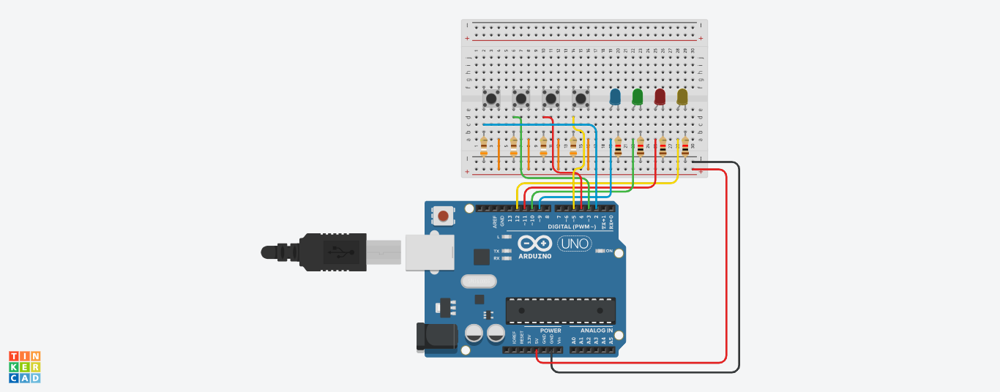

# Jogo da Memória com Arduino

Este projeto implementa um jogo da memória (estilo Genius / Simon) utilizando a placa Arduino UNO. O jogo gera sequências aleatórias de luzes que aumentam de tamanho e velocidade a cada rodada, desafiando o jogador a repetir os comandos corretamente por meio de botões.

## Componentes Utilizados

* 1 Placa Arduino (Uno, Nano ou equivalente)
* 4 LEDs (conectados às saídas digitais)
* 4 Botões / Push buttons (conectados às entradas digitais)
* Resistores para os LEDs e para os botões (configuração pulldown)
* Protoboard e jumpers para conexões

## Arquitetura de Hardware

O projeto foi desenhado para utilizar quatro canais independentes de interação (LED/Botão). Certifique-se de utilizar resistores adequados para limitar a corrente dos LEDs e resistores de pulldown para garantir a estabilidade digital dos botões.

## Mapeamento de Pinos

| Componente | Função | Pino Arduino |
| :--- | :--- | :--- |
| LED 1 | Indicador Visual 1 | Digital 9 |
| LED 2 | Indicador Visual 2 | Digital 10 |
| LED 3 | Indicador Visual 3 | Digital 11 |
| LED 4 | Indicador Visual 4 | Digital 12 |
| Botão 1 | Entrada do LED 1 | Digital 2 |
| Botão 2 | Entrada do LED 2 | Digital 3 |
| Botão 3 | Entrada do LED 3 | Digital 4 |
| Botão 4 | Entrada do LED 4 | Digital 5 |

## Simulação no Tinkercad

O projeto foi modelado e testado no ambiente virtual do Tinkercad. Você pode visualizar o circuito interativo e testar a simulação online através do link abaixo:

* [Acessar Simulação no Tinkercad](https://www.tinkercad.com/things/5bTb8UuUzYp-memory-game)

### Esquema do Circuito

## Funcionamento do Código

1. **Inicialização**: O jogo executa uma animação piscando todos os LEDs para indicar o início da partida.
2. **Geração da Sequência**: A cada rodada, um novo número aleatório entre 1 e 4 é adicionado ao vetor da sequência. A velocidade da reprodução aumenta progressivamente conforme o jogador avança.
3. **Leitura das Entradas**: O programa aguarda a resposta do jogador para cada passo da sequência através da leitura dos pinos digitais.
4. **Condição de Game Over**: Caso o jogador pressione o botão incorreto, todos os LEDs piscam simultaneamente 5 vezes e o jogo reinicia do zero.
5. **Vitória**: Se o jogador completar com sucesso as 14 rodadas estipuladas pelo limite do vetor, o jogo finaliza acendendo todos os LEDs por 2 segundos antes de reiniciar.

## Como Executar

1. Monte o circuito conforme a descrição dos pinos.
2. Abra o arquivo do código na Arduino IDE ou no VS Code com a extensão PlatformIO.
3. Conecte o Arduino ao computador via USB.
4. Selecione a placa e a porta corretas nas configurações.
5. Faça o upload do código para a placa.

